<b>GITHUB</b>

staging area bizim gorebilecegimiz bir sey degil. burada somut olarak algilayabilecegimiz tek sistem working space. staging area ve commit store soyut alanlar. staging area gecici olarak versiyonlarin depolandigi bir yer. calisma alanimda (working space) bir dosya uretiyorum. orada olusturdugum yapiyi oncelikle staging area ya gonderiyorum gecici bir sekilde orada tutuluyor. karar verip de bunun bir versiyonunu olusturacagim dersem o zaman bu versiyon staging areadan commit store a gonderilir. commit store lokalimizde versiyonlarin tutuldugu yerdir.

working space --> staging area 

staging area --> commit store

**git init** - bunu bir dosya icin bir kez kullaniriz, baslangicta kullaniriz. yeni bir git repositorysi olusturmak icin kullanilir. her yeni dosya olusturuldugunda git init yazmaya gerek yok

**git status** --> working space veya staging area'nin durumunu gormek icin kullanilir

**git add .** , **git add dosya_adi** --> dosya ekler

**git commit -m"mesaj"** --> versiyonlari ekleriz

**git log** --> olusturulan versiyonlari bu sekilde goruruz

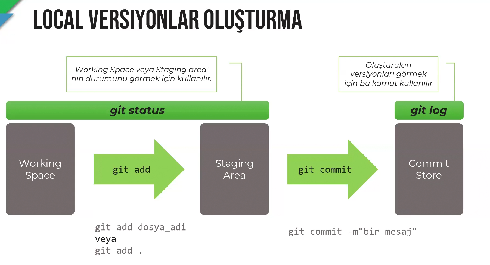

**hash code** unique'tir

**git log --oneline** --> ilk 7 karakteri verir

**git show 0000000** --> versiyonda hangi degisikliklerin yapildigini gosterir

**git restore dosya_adi** , **git restore .** --> working space'te olan hali hazirda staging area'ya gondermedigimiz datalari silebiliriz. en son kaydedilen versiyona doner

**git restore --staged dosya_adi , git restore --staged .** --> staging area'daki degisiklikleri working space'e geri gonderir

**git reset --hard** --> working space'teki degisiklikleri iptal eder, staging area'yi bosaltir

**git checkout 0000000 .**** , **git checkout .** --> hash codu'u yazilan versiyona gider

---------------------------------------------------------

**U** --> untracked, bu dosyayi takip etmiyorsun (dosya adi yaninda cikar)
bir onceki versiyonda olusturulmus olmayan

**M** --> modifiye edildi
hali hazirda olan ve uzerinde degisiklik yapilmis olan

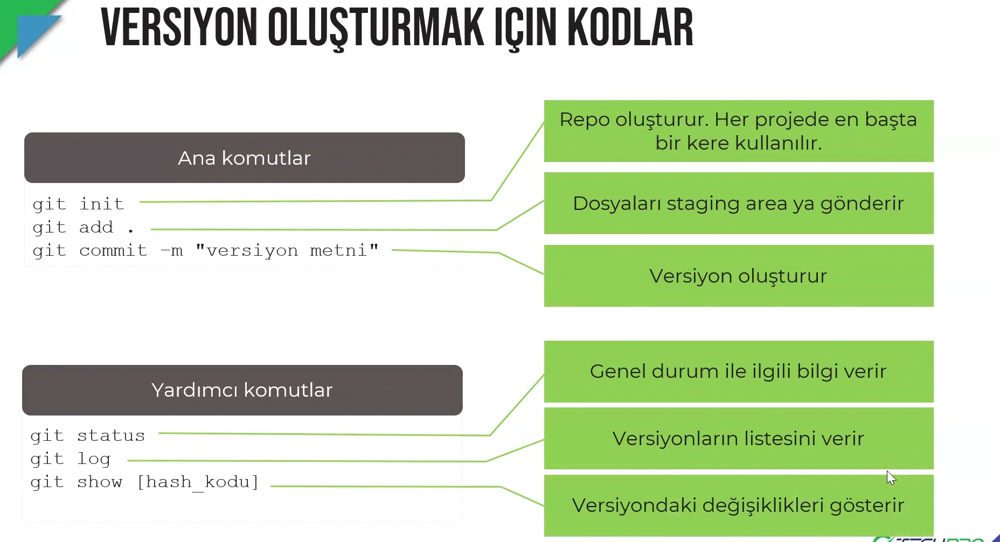

**head** en son alinan commit'e head denir

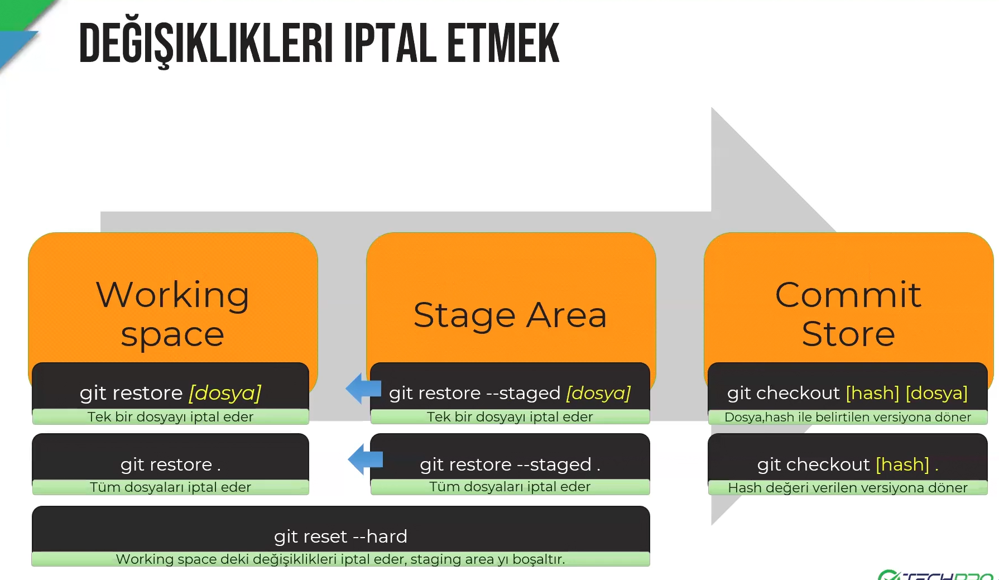

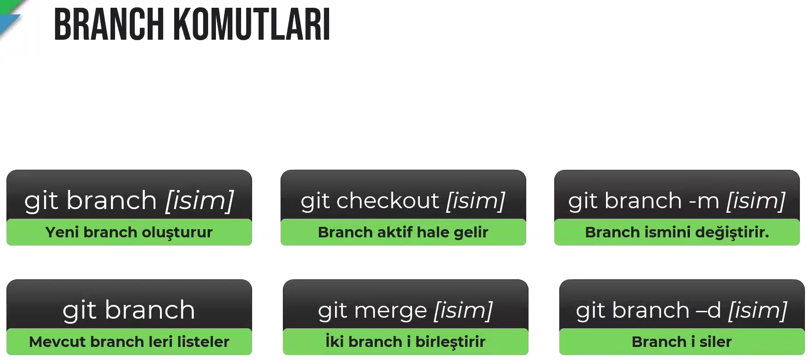

**git branch** ' te asteriks olan branch kullaniliyor demektir. ilk repository olusturuldugu zaman bize bir tane default branch verir. onun adi da master'dir. bu yeni sistemde main diye geciyor. yeni repo oluturdugumuz zaman giyhub uzerinden master branch'i main'e donusturmemizi ister. 

**git branch isim** --> bu sekilde yeni isim olusturulur

**git checkout isim** --> branch degistirilir

**git checkout master(main)** --> master branch'ine doner

**git merge master(main)** --> masterdaki ya da userdaki calismalari birlestirir

**git clone** --> git ve github'i baglamanin iki yontmi var biri git init digeri git clone. ya sistemi lokalde acip github'a baglariz ya da repo'yu github'ta acip lokale baglariz.
bir yerde hali hazirda olusturulmus repo'yu almak icin bu komutu kullaniriz

---------------------------------------------------------

*kendi lokalimizde git init kullarak calistiracagimiz kodlar asagida sirasi iledir*

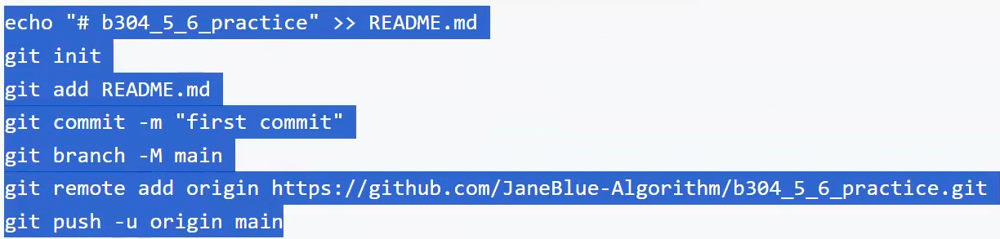

---------------------------------------------------------

**git clone** --> *link*
repo'yu lokale klonlar

---------------------------------------------------------

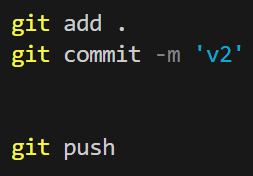

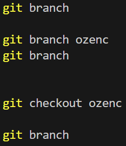

*pushlamak sadece ayni branch'ten ayni branch'e yapilir:*
**git push --set-upstream origin ozenc**

sonrasinda;

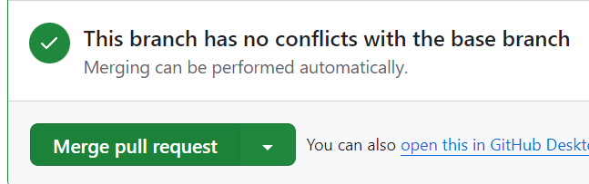

**pull'lamak**
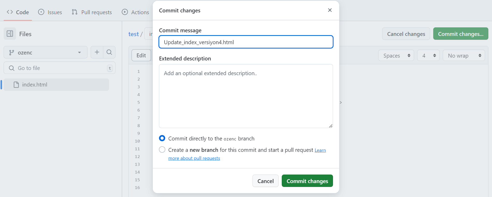
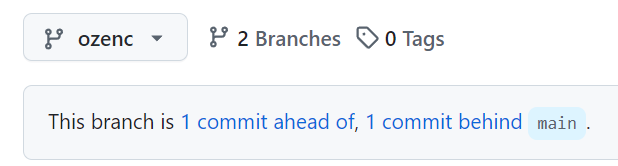
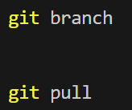

---------------------------------------------------------
<b>TERMINAL KISAYOLLARI</b>

**clear** --> terminali temizler

**cls** --> terminal sayfasini temizler

**pwd** --> su anki konumu gosterir

**cd dosya_adi** --> klasoru acar

**cd ..** --> bir onceki klasore gider
